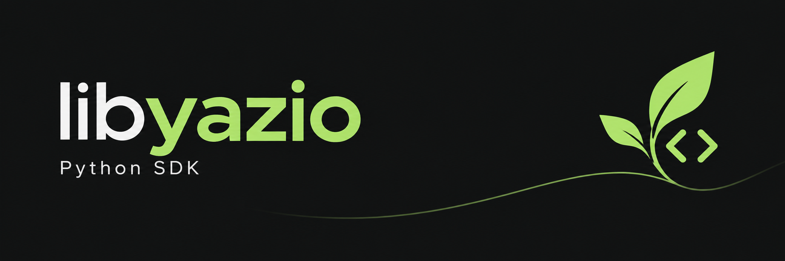

Minimal independent YAZIO SDK. Python 3.10+, zero runtime dependencies, sync/async.

## Install

```sh
pip install "git+https://github.com/ashalogic/libyazio.git@v1.0.0"
```

Requires GitHub access to this private repository. Locally: `pip install .`.

## Use

```python
import os
from datetime import date
from libyazio import YazioClient

client = YazioClient()
client.login(os.environ["YAZIO_EMAIL"], os.environ["YAZIO_PASSWORD"])
diary = client.get_diary(date.today())
```

- Async/FastAPI: use `AsyncYazioClient` and await the same methods.
- Dates: `date` or `YYYY-MM-DD`. Responses: raw JSON.
- API: v22 by default; configurable version, OAuth credentials and User-Agent.
- Tokens refresh in memory. Errors expose `YazioError.status` and `.code`.

## Functions

| Function | Purpose |
| --- | --- |
| `login(username, password)` | Authenticate |
| `refresh()` | Refresh tokens |
| `get_user()` | Profile |
| `get_diary(day)` | Diary entries |
| `get_daily_summary(day)` | Nutrition summary |
| `get_water(day)` | Water intake |
| `get_exercises(day)` | Exercise log |
| `get_goals(day)` | Daily goals |
| `get_weight(day)` | Latest weight on/before date |
| `search_products(query, sex=..., countries=..., locales=...)` | Find food |
| `get_product(product_id)` | Product details |
| `log_food(product_id, amount, when=..., meal=...)` | Log food |
| `add_consumed_items(products=..., recipe_portions=..., simple_products=...)` | Import diary payloads |
| `delete_diary_entry(entry_id, bucket="products")` | Remove entry |
| `add_body_value(entry)` | Write a body measurement payload |
| `request(method, path, params=..., payload=...)` | Other endpoints |

- Food amounts use the product's base unit; timestamps use account-local time.
- Imports accept API payloads, not CSV. Writes aren't automatically retried.
- Async uses worker threads; cancellation doesn't stop an active HTTP request.
- Unofficial API; live account access is unverified. Tests mock HTTP.

## Tests & releases

```sh
python -m unittest discover -v
python -m build
```

- PRs and `main`: test Python 3.10–3.14, build and validate distributions.
- `main`: publish a private GitHub release with wheel/source archive after tests pass.
- Bump `version` in `pyproject.toml` for a new release. Existing releases stay unchanged.
- No PyPI publishing.
